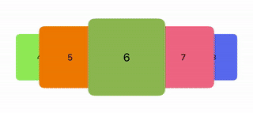

# ZoomCarouselView

A customizable horizontal carousel view with scaling and snapping behavior.



## ✨ Features

- Center item is highlighted with zoom effect
- Smooth snapping and scroll velocity adjustment
- Fully customizable item size, spacing, scale, and offset
- SwiftUI compatible
- Delegates for scroll begin and end
- Option to hide smallest side items

## 📐 Customization

| Parameter          | Description                                              |
|--------------------|----------------------------------------------------------|
| `itemSize`         | Size of each carousel item                               |
| `spacing`          | Spacing between items                                    |
| `sideItemScale`    | Scale factor for non-centered items                      |
| `sideItemShift`    | Vertical shift for side items                            |
| `verticalOffset`   | Additional offset applied vertically                     |

## 🛠 Usage

```swift
struct ItemViewModel: Identifiable {
    let id: String
}

struct ContentView: View {
    @State private var selectedIndex: Int = 0
    private let items = (0..<10).map { ItemViewModel(id: "\($0)") }

    var body: some View {
        ZoomCarouselView(
            selectedIndex: $selectedIndex,
            items: items,
            itemSize: CGSize(width: 120, height: 120),
            spacing: 10,
            sideItemScale: 0.8,
            sideItemShift: 20,
            verticalOffset: 0
        ) { item in
            Text(item.id)
                .frame(width: 120, height: 120)
                .background(Color.blue)
                .cornerRadius(10)
        }
        .frame(height: 140)
    }
}
